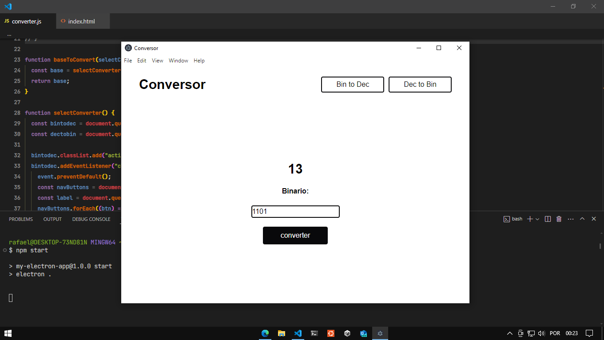

# Conversor binário para descimal

Voltando a estudar conceitos básicos como `Circuitos Digitais` resolvi por criar um algoritmo para conversão de sistemas numéricos.
No entanto para implementar este estudo resolvi também aprender o báscio de como utilizar `Electron-js` para criação de aplicações desktop com `javascript`.

Até o seguinte momento esta aplicação apenas converte binário para descimal, mas futuramente quero implementar:

- [x] Interface interativa
- [ ] Design Responsivo
- [ ] Conversor Octal para Descimal
- [ ] Conversor Hexadecimal para Descimal
- [ ] Conversor Descimal para Binário
- [ ] Conversor Descimal para Octal
- [ ] Conversor Descimal para Hexadecimal
